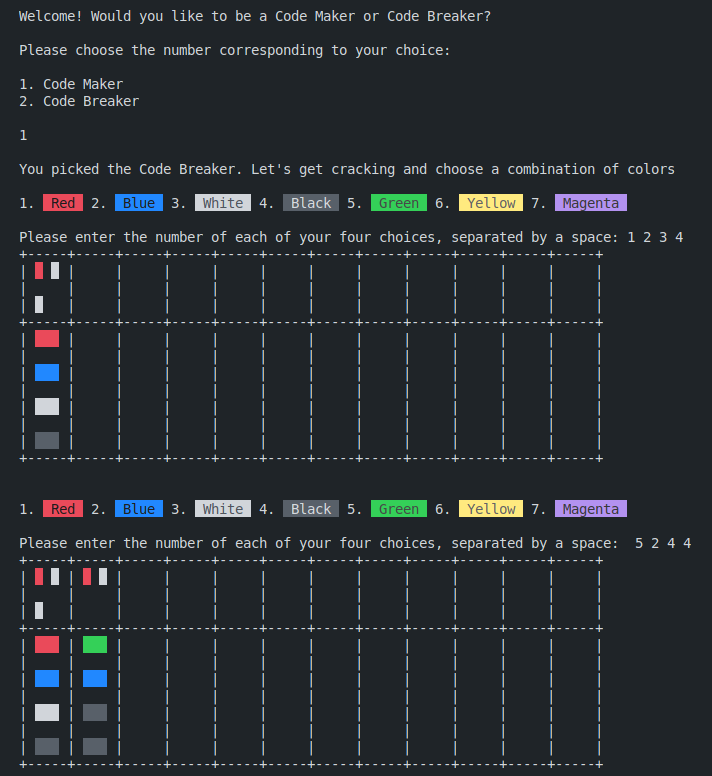

# Mastermind

Mastermind or Master Mind is a code-breaking game for two players invented in Israel.It resembles an earlier pencil and paper game called Bulls and Cows that may date back a century.

This is a Ruby game for Odin Project.

